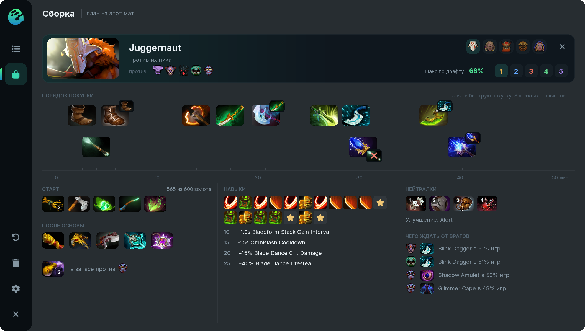

# Build

Open the build from the **Build** tab on the left rail of the window, or click one of our heroes in the draft summary. When the draft is over, Ghost opens your hero's build by itself.

## What the build shows

* **Header:** the hero, whom it plays against, a switch between your allies (any hero of our team), position 1–5 and the draft win chance.
* **Purchase order:** items on a minutes timeline, in the order and at the time pros buy them on this hero and position. Click puts an item into quick buy, Shift+click leaves only that item there.
* **Start:** starting items and their cost.
* **After the core:** what to buy once the core slots are done.
* **In reserve against:** situational items for particular enemies.
* **Skills and talents:** the leveling order.
* **Neutrals:** neutral items by tier and the enhancement.
* **What to expect from the enemies:** the items enemies usually build against such a lineup.

## For this match, not a template

**Lineup.** The model takes all nine other heroes at once and swaps items that work badly against these enemies or with these allies. The item hint tells which hero moved it up or down.

**Enemy items.** During the game Ghost sees what the enemies build and adapts the plan: an enemy Daedalus brings Ghost Scepter; lots of magic damage brings Pipe or BKB. Urgent answers move up the queue, and a warning shows on screen.

**Game state.** Ghost weighs whether you are ahead or behind and who the most dangerous enemy is: answers to that hero's items weigh more.

**Your purchases.** If you buy something off the plan or out of order, the build rebuilds from what you already own: started items get finished and upgrades of your items move up.

**Skills and talents.** The leveling order fits the enemies, the lane and the state of the game, from a model trained on 32,000 pro matches, instead of one template per hero.

**Turbo.** Items come about twice as fast in Turbo, so the timings are rescaled.

## Positions and rare heroes

Every position gets a build. When a hero is rarely played on a position, Ghost adds the hero's games on nearby positions and similar heroes, and the hint says where the numbers come from.

## Bad items

You can hide an item you don't like: **left click** the mark on the item removes it from this hero's builds, **right click** from every hero's builds. The settings list hidden items and bring them back.

## When the plan runs out

With **Upgrades when the build is done** on, after the main plan Ghost suggests upgrades of your items and replacing the weakest one when you have the gold.
