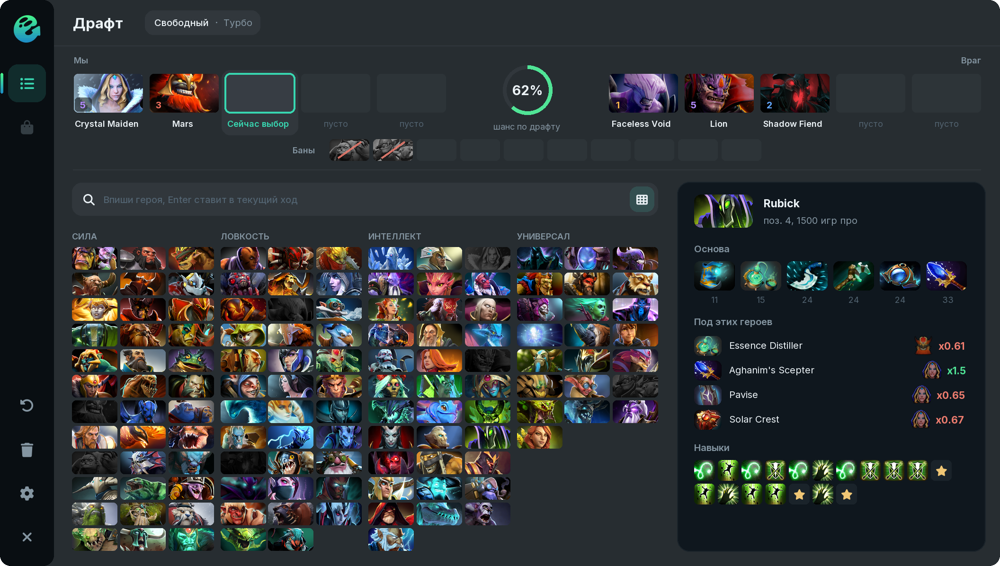
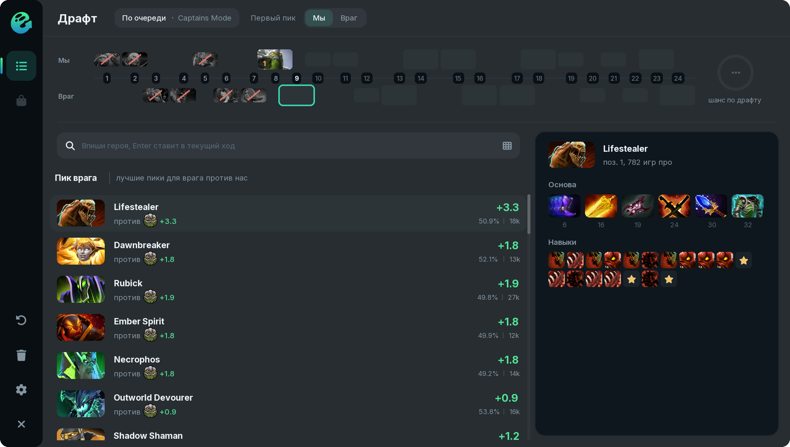
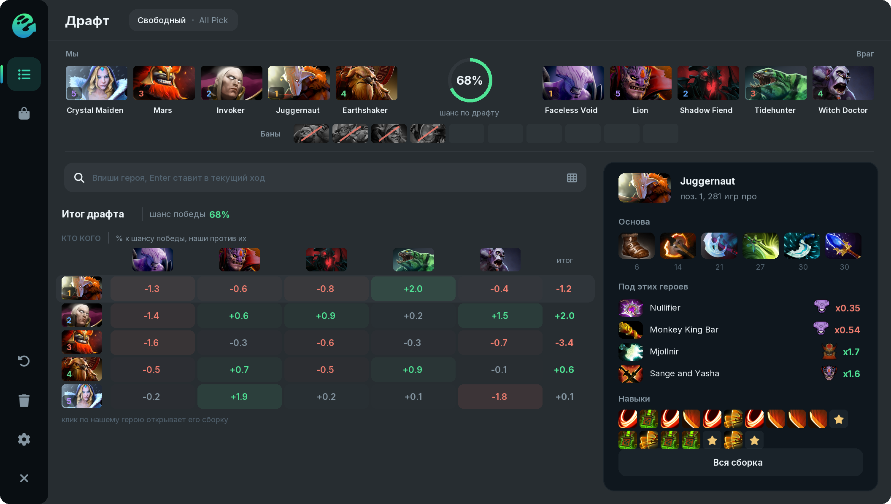

# Draft

The draft window opens by itself on hero pick, and the **Open window** key from **Scripts > Ghost** opens it at any time.

## What the window shows

**Arena.** Our five heroes on the left, the five enemies on the right, the win chance of the current draft between them, and the bans below. The number on a portrait is the hero's position; click it to set the position by hand.

**Hero list.** For every turn Ghost lists heroes for your position: counters to the enemy draft and synergy with your allies. The number on the right is how much the hero adds to the win chance. Below the name you see whom it beats, whom it plays well with and whom it loses to. Buttons 1–5 in the search row pick the position; **auto** takes the position that fits the lineup.

**Build on the right.** Hover a hero to see its core items, the answers to this draft and the skill order.

**Hero grid.** The button in the search row shows every hero by attribute. The grid also opens when you type a name; **Enter** puts the hero into the current turn.

## The draft is read from the game

* picks and bans of both teams;
* your allies' positions from the lobby;
* your allies' tentative picks, shown faded until the game reveals them;
* your allies' hidden picks during hero selection, from their portraits in the top bar.

The mode is detected as well. In Captains Mode bans and picks go in turns: a strip of 24 turns sits on top, and every turn has its own list: who to pick, who to ban, what the enemy may pick or ban. Every other mode (All Pick, Turbo, Single Draft and others) is a free pick.

## Picking and suggesting

* **Right click** a hero in the list to pick it in the game. By default Ghost asks first.
* **Suggest** on a hero and **Suggest top 2** above the list mark heroes as suggested to the team, like the game's own "Suggest hero" button. No chat needed.

## Draft summary

When all ten heroes are in, the list turns into a "who beats whom" table: how much each of our heroes adds to the win chance against each enemy, with a total per row. Click one of our heroes to open its build.

## Data

* Ranked matches from OpenDota: pick the rank (All, Ancient+, Divine+, Divine 5+) and the sample size (50, 100 or 200 thousand matches) in the settings.
* For Captains Mode you can switch to matches of that mode.
* The data refreshes once a day. The first load takes a couple of minutes, after that it comes from the cache.


**Enemy positions and lanes:** counters against your lane opponents weigh more. **Don't rely on allies:** heroes that win lost games on their own go higher. Both are in the [settings](../settings.md).

