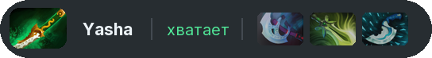
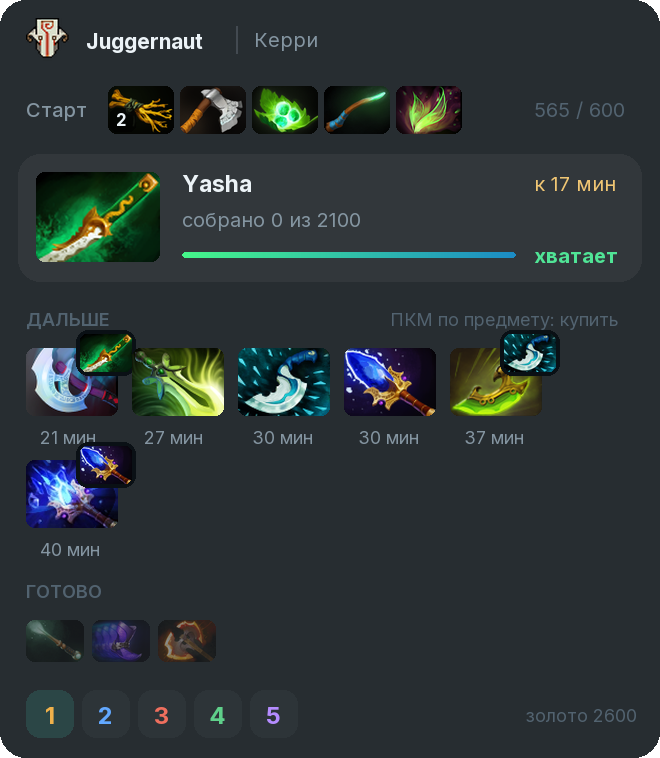
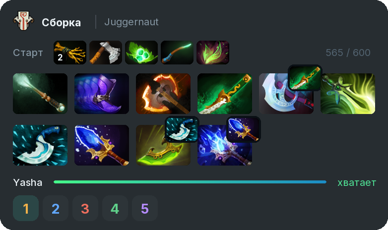

# In-game panel

In the match a build panel stays on the screen. Drag it with the mouse; the settings choose its look, its size and whether it shows only while the shop is open.

## Three looks

<table><thead><tr><th width="160">Look</th><th>What it is</th></tr></thead><tbody><tr><td>Compact</td><td>a slim strip with the next item that expands into the card on hover</td></tr><tr><td>Card</td><td>the next item large, the queue with minutes and what is done</td></tr><tr><td>Grid</td><td>the whole build as tiles in order: start, items and a gold bar to the next one</td></tr></tbody></table>

## What the panel shows

* **Next item:** the minute it is usually bought by, how much gold is already in its parts and whether you can afford it now.
* **Next:** the queue with minutes.
* **Done:** what you already bought from the plan.
* **Position 1–5** and your gold.

**Right click** an item to buy it with the current gold, click puts it into quick buy.

## Warnings

* an item running late compared to other games;
* what you need against enemy items, for example "Enemies have Daedalus: get Ghost Scepter";
* what to sell or move to the backpack when the slots run out.
