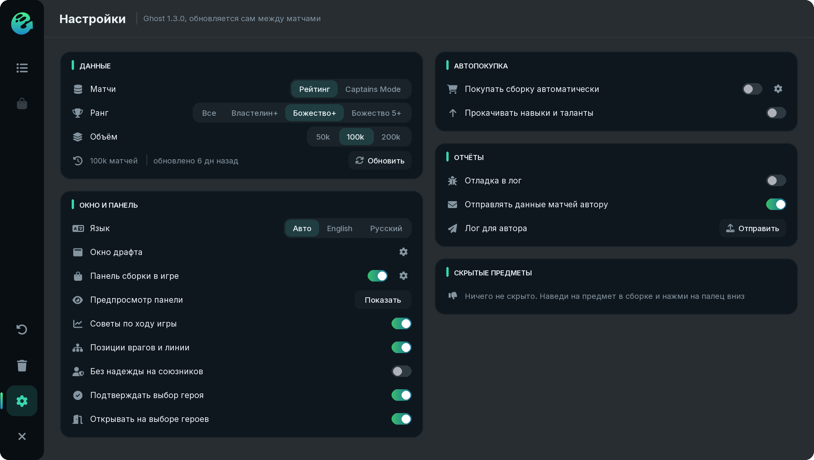

# Settings

The Umbrella menu (**Scripts > Ghost**) has two items: **Enable** and the **Open window** key. Everything else is in the Ghost window: the gear at the bottom of the left rail.

## Data

<table><thead><tr><th width="260">Option</th><th>What it changes</th></tr></thead><tbody><tr><td>Matches</td><td>ranked matches or Captains Mode</td></tr><tr><td>Rank</td><td>All, Ancient+, Divine+, Divine 5+</td></tr><tr><td>Volume</td><td>50, 100 or 200 thousand matches: more matches, steadier numbers</td></tr><tr><td>Update</td><td>download fresh data now instead of waiting for the daily refresh</td></tr></tbody></table>

## Window and panel

<table><thead><tr><th width="260">Option</th><th>What it changes</th></tr></thead><tbody><tr><td>Language</td><td>Auto (as in Umbrella), English or Russian</td></tr><tr><td>Draft window</td><td>under the gear: size, background, background blur, hints</td></tr><tr><td>In-game build panel</td><td>turns the panel on; the gear holds its look, size and the options below</td></tr><tr><td>Panel preview</td><td>shows the panel with a sample build so you can drag it into place</td></tr><tr><td>In-game advice</td><td>selling, late game, neutrals, skills, timings and falling behind</td></tr><tr><td>Enemy positions and lanes</td><td>counters against your lane opponents weigh more, enemy supports' items less</td></tr><tr><td>Don't rely on allies</td><td>the draft favors heroes that win games alone; the build favors items for playing alone</td></tr><tr><td>Confirm hero pick</td><td>asks before picking a hero with right click</td></tr><tr><td>Open on hero pick</td><td>the window opens by itself during hero selection</td></tr></tbody></table>

Under the panel gear:

* **Look:** Compact, Card or Grid, and the panel **size**.
* **Only while the shop is open.**
* **Adapt to enemy items:** the plan follows what the enemies build.
* **Weigh the most dangerous enemy:** answers to the items of the enemy with the most kills and damage on you weigh more.
* **Track damage taken (unsafe):** see who hits you and with what; needs Umbrella's unsafe mode and a script reload.
* **Keep buying after the core:** once the core is done, the next items come from the same pro data, upgrades first.
* **Upgrades when the build is done:** when the plan runs out, upgrades of your items and a swap of the weakest one.
* **Turbo: faster timings:** in Turbo the minutes and thresholds are multiplied by 0.45.

## Auto buy

**Buy the build automatically** and **Level skills and talents**; the gear holds selling, buyback, teleport, courier and item replacement. Details on the [Auto buy](features/auto-buy.md) page.

## Reports

<table><thead><tr><th width="260">Option</th><th>What it does</th></tr></thead><tbody><tr><td>Debug log</td><td>detailed Ghost lines in Umbrella's debug.log</td></tr><tr><td>Send match data to the author</td><td>after a match sends the match record (draft, purchases, the build plan as it changed) and the log, errors too</td></tr><tr><td>Log for the author</td><td>sends the log, settings and errors right now</td></tr></tbody></table>


Reports never include your nick or Steam ID.


## Hidden items

The items you hid from builds. Click one to bring it back.
