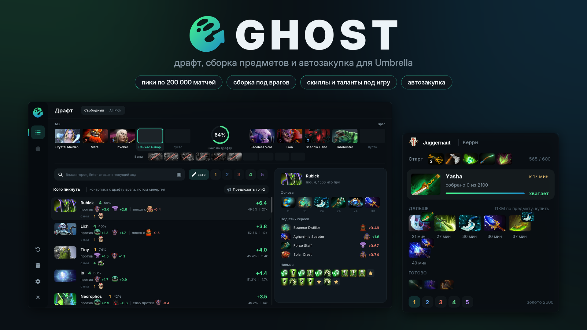

# Ghost

Подсказки на драфте, сборка предметов под матч и автозакупка для Umbrella (Dota 2). Ghost читает драфт прямо из игры, подсказывает пик под врагов и союзников, а в матче показывает, что покупать дальше, и может покупать сам.

<!-- versions:start -->
**Скачать:** [draft_helper.lua](https://github.com/gademoffshit/draft-helper/releases/download/v1.3.0/draft_helper.lua) `v1.3.0`, 2026-10-08

Все версии

| Версия | Дата | Файл |
| --- | --- | --- |
| [`v1.3.0`](https://github.com/gademoffshit/draft-helper/tree/v1.3.0) | 2026-10-08 | [draft_helper.lua](https://github.com/gademoffshit/draft-helper/releases/download/v1.3.0/draft_helper.lua) |
| [`v1.2.24`](https://github.com/gademoffshit/draft-helper/tree/v1.2.24) | 2026-10-08 | [draft_helper.lua](https://github.com/gademoffshit/draft-helper/raw/v1.2.24/draft_helper.lua) |
| [`v1.2.23`](https://github.com/gademoffshit/draft-helper/tree/v1.2.23) | 2026-10-08 | [draft_helper.lua](https://github.com/gademoffshit/draft-helper/raw/v1.2.23/draft_helper.lua) |
| [`v1.2.22`](https://github.com/gademoffshit/draft-helper/tree/v1.2.22) | 2026-10-08 | [draft_helper.lua](https://github.com/gademoffshit/draft-helper/raw/v1.2.22/draft_helper.lua) |
| [`v1.2.21`](https://github.com/gademoffshit/draft-helper/tree/v1.2.21) | 2026-10-08 | [draft_helper.lua](https://github.com/gademoffshit/draft-helper/raw/v1.2.21/draft_helper.lua) |
| [`v1.2.20`](https://github.com/gademoffshit/draft-helper/tree/v1.2.20) | 2026-10-08 | [draft_helper.lua](https://github.com/gademoffshit/draft-helper/raw/v1.2.20/draft_helper.lua) |
| [`v1.2.19`](https://github.com/gademoffshit/draft-helper/tree/v1.2.19) | 2026-10-08 | [draft_helper.lua](https://github.com/gademoffshit/draft-helper/raw/v1.2.19/draft_helper.lua) |
| [`v1.2.18`](https://github.com/gademoffshit/draft-helper/tree/v1.2.18) | 2026-10-08 | [draft_helper.lua](https://github.com/gademoffshit/draft-helper/raw/v1.2.18/draft_helper.lua) |

<!-- versions:end -->


Язык берётся из настроек Umbrella: Ghost говорит по-русски и по-английски. Новые версии ставятся сами между матчами.


## Что умеет

<table><thead><tr><th width="220">Раздел</th><th>Что делает</th></tr></thead><tbody><tr><td><a href="vozmozhnosti/draft.md">Драфт</a></td><td>кого пикнуть и кого забанить под этот драфт, шанс на победу, итоговая таблица «кто кого»</td></tr><tr><td><a href="vozmozhnosti/sborka.md">Сборка</a></td><td>порядок покупок, навыки, таланты и нейтралки под твою позицию, врагов и ход игры</td></tr><tr><td><a href="vozmozhnosti/panel.md">Панель в матче</a></td><td>следующий предмет, тайминги и предупреждения прямо на экране</td></tr><tr><td><a href="vozmozhnosti/avtozakupka.md">Автозакупка</a></td><td>покупка по частям, курьер, выкуп, телепорт, продажа и рюкзак</td></tr><tr><td><a href="nastrojki.md">Настройки</a></td><td>все пункты окна настроек и что они меняют</td></tr></tbody></table>

## Откуда данные

* Драфт: рейтинговые матчи с OpenDota, до 200 000 на каждый ранг, и матчи Captains Mode. Данные обновляются раз в сутки, Ghost сам скачивает их и хранит в кэше.
* Сборка: про-матчи на этом герое и позиции, тайминги покупок из пабликов, отдельные модели для составов, предметов врагов, навыков и талантов.
* Если OpenDota или GitHub недоступны, Ghost работает на сохранённых данных.

## Быстрый старт

1. Скачай `draft_helper.lua` и положи его в папку `scripts` Umbrella.
2. Открой **Scripts > Ghost**, включи **Включить** и назначь клавишу **Открыть окно**.
3. Окно откроется само на выборе героев, панель сборки появится в матче.

Подробнее: [Установка и обновление](ustanovka.md).
