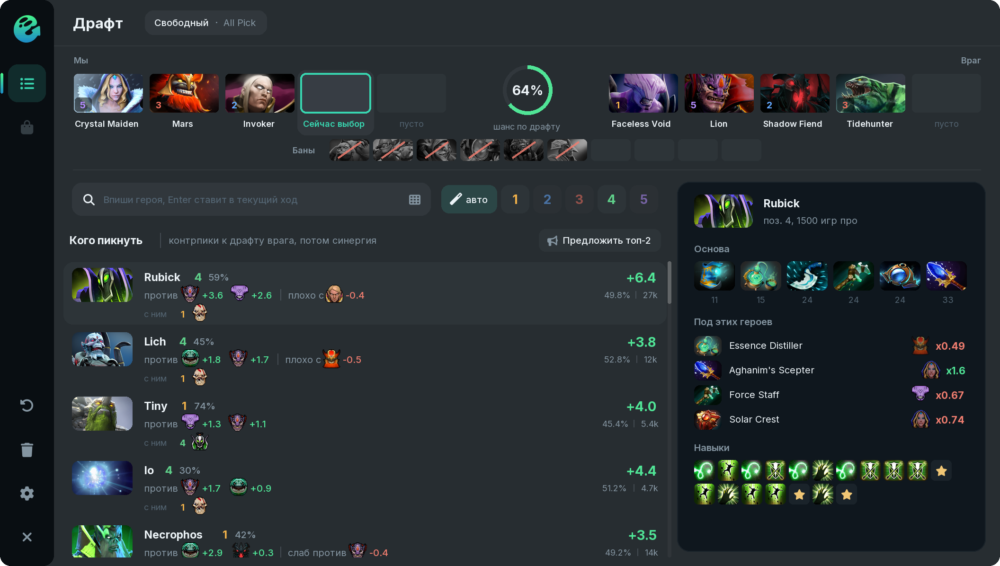

# Драфт

Окно драфта открывается само на выборе героев, а в любой момент его открывает клавиша **Открыть окно** из меню **Scripts > Ghost**.

## Что видно в окне

**Арена.** Сверху пять наших героев слева, пять врагов справа, между ними шанс на победу по текущему драфту. Под ними ряд банов. Цифра на портрете показывает позицию героя, по клику её можно поменять вручную.

**Список героев.** На каждый ход Ghost показывает героев на твою позицию: контрпики к драфту врага и синергию с союзниками. Число справа показывает, сколько герой добавляет к шансу на победу. Под именем видно, против кого он хорош и с кем, а также кому он проигрывает. Позицию выбирают кнопки 1–5 в строке поиска, кнопка **авто** берёт позицию, которая подходит составу.

**Сборка справа.** При наведении на героя справа показывается его основа, ответы на этот драфт и порядок навыков.

**Сетка героев.** Кнопка в строке поиска показывает всех героев по атрибутам. Сетка открывается и при вводе имени, **Enter** ставит героя в текущий ход.

## Драфт читается из игры

* пики и баны обеих команд;
* позиции союзников из лобби;
* предварительный выбор союзников: такой герой показан полупрозрачным, пока игра его не открыла;
* скрытые пики союзников на стадии выбора, по их портретам в верхней панели.

Режим тоже определяется сам. В Captains Mode баны и пики идут по очереди: сверху лента из 24 ходов, и на каждый ход свой список: кого пикнуть, кого забанить, что могут взять или забанить враги. В остальных режимах (All Pick, Турбо, Single Draft и других) выбор свободный.

## Выбор и предложение героя

* **Правый клик** по герою в списке выбирает его в игре. По умолчанию Ghost сначала спрашивает подтверждение.
* **Предложить** у героя и **Предложить топ-2** над списком отмечают героев как предложенных команде, как кнопка «Предложить героя» в самой игре. Писать в чат не нужно.

## Итог драфта

Когда все десять героев выбраны, вместо списка появляется таблица «кто кого»: сколько процентов к шансу на победу даёт каждый наш герой против каждого врага, и итог по строке. Клик по нашему герою открывает его сборку.

## Данные

* Рейтинговые матчи с OpenDota: в настройках выбирается ранг (Все, Властелин+, Божество+, Божество 5+) и объём выборки (50, 100 или 200 тысяч матчей).
* Для Captains Mode в настройках можно переключиться на матчи этого режима.
* Данные обновляются раз в сутки. В первый раз загрузка занимает пару минут, дальше всё берётся из кэша.


**Позиции врагов и линии:** контрпики против соперников по линии весят больше. **Без надежды на союзников:** выше герои, которые сами вытаскивают проигранные игры. Оба пункта в [настройках](../nastrojki.md).

